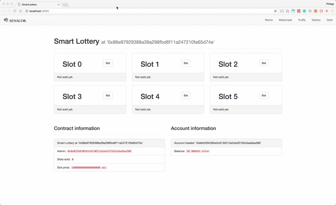

# Smart Contract Workshop

## Goal: your own Lottery DApp



## Instructions

### Requirements & Tooling

Make sure to have the following tools installed on your machine

 1. [nodejs](https://nodejs.org/en/download/) in the latest version (tested node.js (>= v6.11.5) )
 2. [testrpc](https://github.com/ethereumjs/testrpc) see instructions in project setup
 3. [Metamask](http://metamask.io) Chrome or Firefox extension
 4. [Sublime Text](http://sublimetext.com) or any other text editor/IDE you already use
 5. [Git](https://git-scm.com/downloads)

### Project setup

1. In a destination of your choice, e.g. your desktop or `~/code/`, clone this repository with `git clone <repository url>` or download it
2. Navigate with terminal to the folder `SmartLottery` you just created. From now on, all commands shown should be executed inside this `SmartLottery` directory.
3. Inside this folder run `npm install -g ethereumjs-testrpc` to install the testrpc client. testrpc is a node.js based Ethereum client, especially useful for testing and development purposes by simulating a full Ethereum client. Be patient as installation may take some time.
4. Run `npm install` to download missing packages for the frontend application.

That's it, you are ready to roll!

### Running the testrpc

1. In your `SmartLottery` folder start up testrpc with executing `testrpc` in your terminal
2. The output will look like this, giving you a simulated ethereum client on your local machine exposed on port 8545 with predefined accounts, that have 100 testethers each. Save the mnemonic words somewhere for later.

```
Available Accounts
==================
(0) 0x4866a48f97cee3c3b6d4f749fcdc630cdedb6a2d
(1) 0xbf59a5dfc3998eecf6877fa85f4820901bce1af7
(2) 0x40ff2f06eb7366fe0ec7a3ff7a1211c2a3f2e5ed
...

Private Keys
==================
(0) bbf2169d7c3022e1fab7c9a504a1f44fc1fa541280455e81bafb9973fe7dd9f6
(1) 6bac1dc3cd780225d8bee781279cbf49a767fec013b1266eb5a9906d40db3978
(2) d71ea5e4af9a9727cb36a4774783a893ede6ab2b2cabcfdaab0a5ea56719c124
(3) f90d0a6775aca7a9c662a05512b0c7f37bb86ab43e3623ecdbbca6ba537ed407
...

HD Wallet
==================
Mnemonic:      fashion edit hawk describe slush exercise trick scan practice silk pond vital
Base HD Path:  m/44'/60'/0'/0/{account_index}

Listening on localhost:8545
```

### Smart Contract development with Remix

1. Visit http://remix.ethereum.org in your browser to get the Remix Ethereum IDE.
2. Copy the provided code from the `notes/01_SmartLottery.sol` file into the editor to have syntax highlighting and code annotations. Advanced setup: You can alternatively link your local folder to Remix or use your own IDE/editor with Solidity code support.
3. Try to fill out the missing pieces of code, diving deep into the Solidity language. As a reference, the [Solidity documentation](https://solidity.readthedocs.io/en/develop/) might be helpful. Do not change the given methods, method parameters or variables.

### Test your contract

tbd.