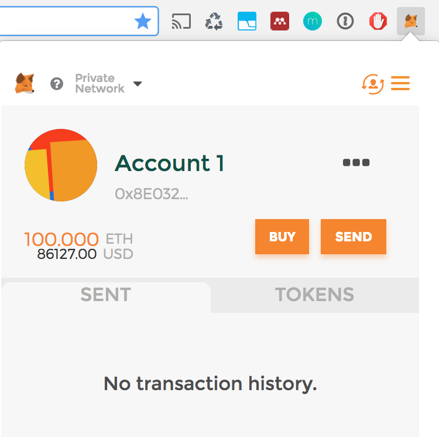

# Smart Contract Workshop

### From Contract to DApp

Make sure, all packages are installed. Since you switched branches, type `npm install` again to get all
missing packages for the frontend application in your `SmartLottery` directory.

### Connecting to web3

In order to make any UI able to "speak" via RPC calls, you may use [Ethereums web3.js](https://github.com/ethereum/web3.js/) library.
It creates a connection to a web3-capable client, just like `ganache-cli` and may communicate over a specified URL and port.
If you followed the instructions, ganache-cli used no specific port or url. This defaults to `http://localhost:8545` respectively `http://127.0.0.1:8545`.

Usually, any Ethereum client software such as geth, parity or the simulated ganache-cli is capable of assigning custom IPs/domains and ports.

In `src/js/app.js` your Decentralized Application is trying to connect to a client via web3.
```
if (typeof web3 !== 'undefined') {
   App.web3Provider = web3.currentProvider;
 } else {
   App.web3Provider = new Web3.providers.HttpProvider('http://localhost:8545');
 }
```
This snippet as defined by web3.js tries to connect to a web3 provider/a blockchain it can talk to via RPC calls.

### Providing web3 endpoint

In order to connect to the fronted-application with above snippet, you need to run a client, that connects to a blockchain node. In our case, we will use Metamask.
Make sure ganache-cli is still running and copy the 12 word mnemonic into memory again.

In your browser you should find Metamask installed, accept all agreements and proceed in choosing a network different from the Ethereum Mainnet.
You may set the network in Metamask to "Localhost 8545" or to "Custom RPC". If you chose "Custom RPC", then enter `http://127.0.0.1:8545` as RPC connection.

After setting the correct network to our ganache-node, click "Logout" inside Metamask (Burger Menu Icon) and re-login using 
the option "Restore with seed-phrase", as if you had forgotten your password. Here you may enter the 12 word menomic words
to restore the accounts, as shown in ganache inside of Metamask. Choose some easy to remember password, you will use those
accounts only locally.

Your Metamask account should now show the first account as listed in ganache prefilled with testether.


### Try filling out the missing pieces in the frontend

##### 1. Making contract calls / writing getter functions
With the use of web3, you may interact with the contract and its functions. Go to `src/js/app.js` and try to fill out the blanks.
The snippet may help you get along with query data from a contract and resolving promises.

```
var smartLotteryInstance;

App.contracts.SmartLottery.deployed().then(function(instance) {
  smartLotteryInstance = instance;
  return smartLotteryInstance.<attribute name/function() call>;
}).then(function(result)  {
  // do something with the promised result
  // $('<some HTML identifier>').text('Put result here:' + <result variable>);
}).catch(function(err) {
  console.log(err.message);
});
```

##### 2. Calling contract transactions / makeBet() function

Now, try to write the function for making a bet. Instead of just querying data in a call, this time you need to build and send a transaction.
The above code may again be helpful to make calls to a contract. 

Calling the contract's `bet()` function in `makeBet()` function must provide a `slotId` as a parameter to specificy the slot that should be bought.
Additionally, if ethers are transferred, further parameters must be passed along when calling the bet() function.  A transaction that wants to send ethers must specify three parameters in an json object:
                                     
```
{ 
 from: <the account sending the transaction>,
 to: <receiving address/contract address>,
 value: <amount of wei to send in the transaction>
}
```
The ticketprice you need to define is 1 ether. Either you may define this sum in wei, a subunit of ether, using a [helpful converter](https://etherconverter.online/) or you make use of [helpful web3.js converter functions like](https://github.com/ethereum/wiki/wiki/JavaScript-API#web3towei) `web3.toWei()`. 

After the transaction is sent and the promise is resolved, call `markSlotsSold()` to update the UI.

### Running the Lottery web app

To spin up the frontend, in your main directory `SmartLottery` run the command `npm run dev` in a new command line window to get the DApp running.
A webserver should start and display how to access the website locally.

### Congratulations!

To see the final DApp, proceed by executing `git checkout stage-dapp`