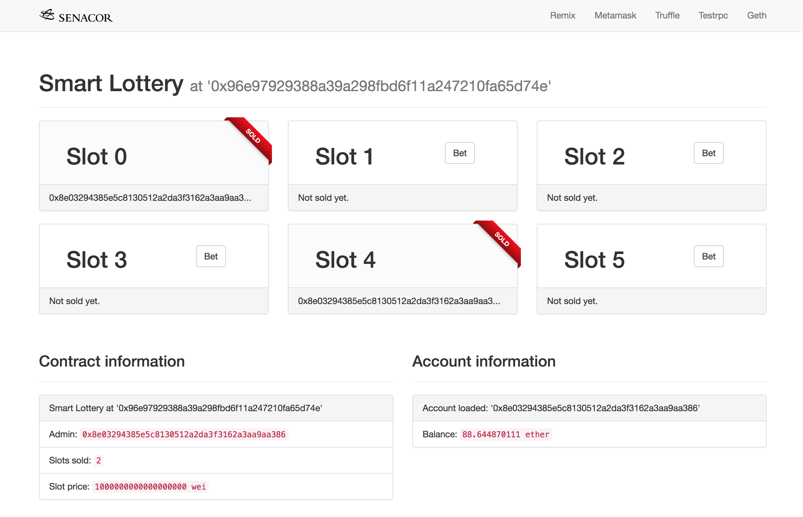

# Smart Contract Workshop

## Build your own Lottery DApp



## Instructions

### Requirements & Tooling

Make sure to have the following tools installed on your machine

 1. [nodejs](https://nodejs.org/en/download/) in the latest version (tested node.js (>= v6.11.5) )
 2. [testrpc](https://github.com/ethereumjs/testrpc) see instructions in project setup
 3. [Metamask](http://metamask.io) Chrome or Firefox extension
 4. [Sublime Text](http://sublimetext.com) or any other text editor/IDE you already use
 5. [Git](https://git-scm.com/downloads)

### Project setup

1. In a destination of your choice, e.g. your desktop or `~/code/`, clone this repository with `git clone <repository url>` or download it
2. Navigate with terminal to the folder `SmartLottery` you just created. From now on, all commands shown should be executed inside this `SmartLottery` directory.
3. Inside this folder run `npm install -g ethereumjs-testrpc` to install the testrpc client. testrpc is a node.js based Ethereum client, especially useful for testing and development purposes by simulating a full Ethereum client. Be patient as installation may take some time.

That's it, you are ready to roll!

### Running the testrpc

1. In your `SmartLottery` folder start up testrpc with executing `testrpc` in your terminal
2. The output will look like this, giving you a simulated ethereum client on your local machine exposed on port 8545 with predefined accounts, that have 100 testethers each. Save the mnemonic words somewhere for later.

```
Available Accounts
==================
(0) 0x4866a48f97cee3c3b6d4f749fcdc630cdedb6a2d
(1) 0xbf59a5dfc3998eecf6877fa85f4820901bce1af7
(2) 0x40ff2f06eb7366fe0ec7a3ff7a1211c2a3f2e5ed
...

Private Keys
==================
(0) bbf2169d7c3022e1fab7c9a504a1f44fc1fa541280455e81bafb9973fe7dd9f6
(1) 6bac1dc3cd780225d8bee781279cbf49a767fec013b1266eb5a9906d40db3978
(2) d71ea5e4af9a9727cb36a4774783a893ede6ab2b2cabcfdaab0a5ea56719c124
(3) f90d0a6775aca7a9c662a05512b0c7f37bb86ab43e3623ecdbbca6ba537ed407
...

HD Wallet
==================
Mnemonic:      fashion edit hawk describe slush exercise trick scan practice silk pond vital
Base HD Path:  m/44'/60'/0'/0/{account_index}

Listening on localhost:8545
```

### Smart Contract development with Remix

1. Visit http://remix.ethereum.org in your browser to get the Remix Ethereum IDE.
2. Copy the provided code from the `notes/01_SmartLottery.sol` file into the editor to have syntax highlighting and code annotations. Advanced setup: You can alternatively link your local folder to Remix or use your own IDE/editor with Solidity code support.
3. Try to fill out the missing pieces of code, diving deep into the Solidity language. As a reference, the [Solidity documentation](https://solidity.readthedocs.io/en/develop/) might be helpful. 

Tips:
* Do *not* change the given methods, method parameters or variables.
* Start small, write the getter-methods first.
* Try to understand the concepts, even if you can't get everything running, the code will be provided during the next steps.

### Done coding? Test your contract manually using Remix

On the built-in Remix EVM:

1. Go to `Run > Environment` and set Environment to `Javascript VM` to use the built-in Remix virtual machine.
2. Select the account, you want to deploy the contract with (any of them should be fine)
3. Select `SmartLottery` as the contract name you want to deploy and press the red `Create` button to send the contract creation transaction to the (simulated) blockchain client. You should now see some buttons to interact with the contract functions.

### Deploy the contract locally on testrpc

Alternatively, you can run your contract locally on testrpc and interact with it using Remix.

1. Check if testrpc is still running, otherwise fire it up again with `testrpc` in your terminal. By default it should communicate on `http://localhost:8545`. If you want to reuse the same accounts, you can start testrpc by feeding it the 12 mnemonic words as listed on the first start of testrpc. Try to recreate the same accounts with executing `testrpc -m "fashion edit hawk describe slush exercise trick scan practice silk pond vital"`. Whereas you may substitute the 12 menemonic words with those you have saved previously.
2. In Remix, set `Run > Environment` to `Web3 Provider` and  enter `http://localhost:8545`, if issues occur try `http://127.0.01:8545`. You can use this method to provide *any* ethereum client, e.g. geth or parity. For convenience, we will just use testrpc in this workshop, as geth or other clients might take a longer while to sync. After you successfully connected to the client, you should be able to see the same 10 addresses, as previously shown when firing up testrpc on the commandline, each of them pre-filled with 100 testethers. 
3. Select `SmartLottery` as the contract name you want to deploy and press the red `Create` button to send the contract creation transaction to the (simulated) blockchain client. You should now see some buttons to interact with the contract functions.

### Play the lottery without a fronted

In Remix, you should now have a functioning contract you can interact with. Feel free to play around, these given steps may help you. 

As you may see, there are buttons in different colors. Blue colored buttons are *calls*, that only query data in a "read-only" fashion, therefore do not cost any ether. On the other side, red buttons depict *transactions*, that perform write-operations on a blockchain that need to update state or update other accounts. As something gets persisted on the chain, ether must be sent to pay for the miner to include the transaction in a block.


### Congratulations!

You may now start with developing the matching frontend application to your contract.
To progress to the next part, inside the project directory, type `git checkout stage-testing` and have a look at the instructions in  the readme file.